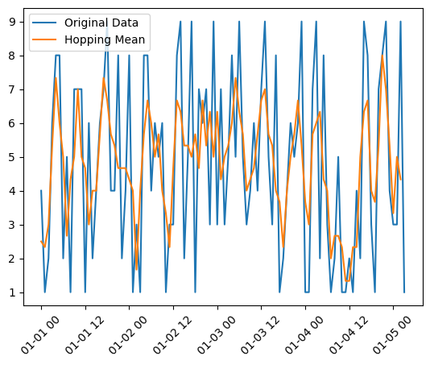

# Hopping Window Mean

This project demonstrates how to calculate the mean values of sensor readings using a hopping window function in a distributed environment. The sensor system generates temperature readings every second, and the stream processor aggregates these readings to increase throughput and reduce latency.


## Setup

To set up the environment, follow these steps:

1. **Create a Virtual Environment**:
   ```sh
   python3 -m venv venv
   ```

2. **Activate the Virtual Environment**:
    ```sh
    source venv/bin/activate
    ```

3. **Install Dependencies**:
    ```sh
    pip install -r requirements.txt
    ```

## Output




